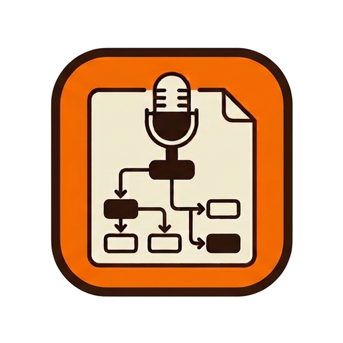

<div align="center">



# MicToText

**Dalla voce agli appunti, agli schemi. Tutto in locale.**

Registra una lezione, la trascrive, ne ricava appunti strutturati in Markdown
e genera schemi e schede concetto. Nessun servizio cloud, nessun abbonamento:
audio e testi non lasciano mai il tuo computer.

</div>

---

## Indice

- [Cosa fa](#cosa-fa)
- [Requisiti](#requisiti)
- [Installazione](#installazione)
- [Avvio](#avvio)
- [Uso da riga di comando](#uso-da-riga-di-comando)
- [Configurazione](#configurazione)
- [Struttura del progetto](#struttura-del-progetto)
- [Risoluzione dei problemi](#risoluzione-dei-problemi)
- [Limiti noti](#limiti-noti)

---

## Cosa fa

La pipeline parte da una sorgente audio e arriva a materiale di studio:

```
microfono / URL video / file locale
        ↓  faster-whisper (GPU, con ripiego automatico su CPU)
   trascrizione
        ↓  LLM locale via Ollama
   appunti strutturati in Markdown
        ↓  LLM locale
   schema logico + schemi per argomento + schede concetto
        ↓  mermaid-cli
   immagini PNG o SVG
```

**Funzionalità principali**

- **Tre sorgenti**: microfono (con pausa e ripresa), URL di un video (YouTube e ~1800 altri
  siti, scarica **solo l'audio**), file audio o video locale letto dov'è, senza copie.
- **Sezioni**: trascrive solo gli intervalli scelti, per saltare le parti inutili di una lezione.
- **Filtro pause e rumore**: individua silenzi lunghi e parlato incerto e propone cosa scartare.
- **Due livelli di schemi**: uno schema relazionale che mostra le connessioni fra i concetti, e
  schede discorsive che spiegano ogni concetto chiave (definizione, meccanismo, esempio, errore
  tipico).
- **Contenuti lunghi**: oltre una certa lunghezza gli appunti si dividono per argomento, e ogni
  argomento riceve il proprio schema.
- **Modifica mirata**: un modulo di riscontro a quattro campi rigenera un singolo schema o scheda.
- **Controllo avanzato**: una ventina di parametri regolabili dall'interfaccia, ciascuno con la
  spiegazione di cosa cambia alzandolo o abbassandolo.
- **Interruzione**: un pulsante ferma qualunque fase in corso, trascrizione compresa.

---

## Requisiti

### Software

| Componente | Versione | Note |
|---|---|---|
| **Python** | **3.12** consigliato | 3.10+ funziona, ma le ruote di `ctranslate2` seguono le versioni più recenti con ritardo |
| **[Ollama](https://ollama.com)** | qualsiasi recente | In esecuzione su `127.0.0.1:11434` |
| **Node.js + npm** | LTS | Serve per `mermaid-cli` |
| **mermaid-cli** | 11+ | `npm install -g @mermaid-js/mermaid-cli` |

Non serve installare FFmpeg: PyAV include le librerie necessarie.

### Hardware

| | Minimo | Consigliato |
|---|---|---|
| **GPU** | nessuna (ripiego su CPU) | NVIDIA con 8 GB di VRAM |
| **RAM** | 8 GB | 16 GB |
| **Disco** | ~20 GB | dipendenze, modelli Ollama e Whisper, Chromium |

Senza GPU NVIDIA tutto funziona, ma la trascrizione è sensibilmente più lenta.

### Sistemi operativi

Sviluppato e collaudato su **Windows 11**. Il codice Python è multipiattaforma e i punti
specifici di Windows sono protetti, ma su Linux e macOS **non è stato provato**.
L'avviatore `MicToText.exe` è solo per Windows.

---

## Installazione

### 1. Clona il repository

```bash
git clone https://github.com/FrancescoSposato/MicToText.git
cd MicToText
```

### 2. Crea l'ambiente virtuale e installa le dipendenze

**Windows (PowerShell)**

```powershell
py -3.12 -m venv .venv
.\.venv\Scripts\Activate.ps1
pip install -r requirements-gpu.txt   # con GPU NVIDIA
# oppure
pip install -r requirements.txt       # solo CPU
```

**Linux / macOS**

```bash
python3.12 -m venv .venv
source .venv/bin/activate
pip install -r requirements.txt
```

> `requirements-gpu.txt` aggiunge le librerie CUDA (cuBLAS e cuDNN) necessarie a far girare
> Whisper su GPU: circa 1 GB di download. Su GPU **RTX serie 50 (Blackwell)** serve cuBLAS 12.8
> o successivo, già richiesto dal file.

### 3. Scarica un modello per Ollama

```bash
ollama pull qwen3.5:9b
```

È il modello predefinito, e quello consigliato per 8 GB di VRAM. Occupa circa 5,5 GB di VRAM e
sta interamente in GPU. Alternative più leggere se hai meno memoria: `qwen3.5:4b` o `gemma4:e4b`,
da selezionare poi nel menu dell'interfaccia.

### 4. Installa mermaid-cli

```bash
npm install -g @mermaid-js/mermaid-cli
mmdc --version
```

Al primo utilizzo Puppeteer scarica un Chromium (~1,3 GB).

### 5. Verifica

```bash
python -m mictotext --list-devices   # elenca i microfoni
python -m mictotext.web              # avvia l'interfaccia
```

I modelli Whisper vengono scaricati da Hugging Face al primo uso
(`large-v3-turbo`, circa 1,6 GB).

---

## Avvio

### Interfaccia web

```bash
python -m mictotext.web
```

Apre da sola `http://127.0.0.1:8765/` nel browser. Il server ascolta **solo su localhost**:
non è raggiungibile dalla rete. `Ctrl+C` per fermarlo.

### Avviatore per Windows

Nella cartella del progetto c'è `MicToText.Launcher.cs`, sorgente di un piccolo eseguibile che
controlla l'ambiente, avvia Ollama se serve e apre l'app con un doppio clic. Per compilarlo:

```powershell
C:\Windows\Microsoft.NET\Framework64\v4.0.30319\csc.exe /target:winexe `
  /win32icon:MicToText.ico /out:MicToText.exe /r:System.Windows.Forms.dll `
  MicToText.Launcher.cs
```

Usa il compilatore C# già presente in Windows: non serve installare nulla.
L'eseguibile va tenuto nella cartella del progetto; per averlo sul desktop, creane un collegamento.

---

## Uso da riga di comando

```bash
python -m mictotext                                    # registra dal microfono
python -m mictotext --url "https://youtube.com/..."    # da un video online
python -m mictotext --audio "C:\...\lezione.mp4"       # da un file locale
```

**Opzioni principali**

| Opzione | Effetto |
|---|---|
| `--keep 2:00-15:30` | Trascrive solo questo intervallo. Ripetibile |
| `--topic "sistemi operativi"` | Argomento: guida appunti e schemi |
| `--subtopics "kernel, memoria"` | Aspetti da privilegiare |
| `--filter-pauses` | Scarta pause e parlato incerto |
| `--cards N` | Numero di schede concetto (0 per nessuna) |
| `--thinking none\|notes\|full` | Quanto ragionamento interno spendere |
| `--llm-model qwen3.5:9b` | Modello per gli appunti |
| `--language it` | Lingua parlata, oppure `auto` |

`python -m mictotext --help` per l'elenco completo.

**Output**: una cartella per sessione in `output/`, chiamata con il titolo che l'IA dà agli
appunti più la data, ad esempio `Sistemi_Operativi_21_09_26/`. Contiene trascrizione, appunti,
schemi e schede.

---

## Configurazione

I valori predefiniti sono in [`mictotext/config.py`](mictotext/config.py). Quasi tutti si
regolano anche dall'interfaccia, nel pannello **Controllo avanzato**, senza toccare il codice.

| Impostazione | Predefinito | A cosa serve |
|---|---|---|
| `notes_model` | `qwen3.5:9b` | Modello per appunti e schemi |
| `gpu_model` | `large-v3-turbo` | Modello Whisper su GPU |
| `think_notes` / `think` | `True` / `False` | Ragionamento solo dove nasce il contenuto |
| `num_ctx` | `16384` | Finestra di contesto |
| `split_topics_over_chars` | `2500` | Oltre questa soglia gli appunti si dividono in più schemi |
| `concept_cards` | `4` | Schede concetto per sessione |
| `renderer` | `auto` | `mmdc` nativo, via WSL, oppure solo HTML |

Il livello di ragionamento è il parametro con più impatto. Misurato sulla stessa sorgente:

| Livello | Tempo | Fedeltà |
|---|---|---|
| `none` | 1 min 22 s | ❌ il modello tende a inventare |
| `notes` (predefinito) | 2 min 12 s | ✅ |
| `full` | 12 min 42 s | ✅ senza vantaggi misurabili |

---

## Struttura del progetto

```
MicToText/
├── mictotext/
│   ├── __main__.py      # python -m mictotext
│   ├── cli.py           # riga di comando
│   ├── web.py           # server Flask + interfaccia (HTML/CSS/JS inclusi)
│   ├── config.py        # tutti i valori predefiniti
│   ├── recorder.py      # cattura dal microfono
│   ├── fetch.py         # download audio da URL (yt-dlp)
│   ├── media.py         # analisi dei file e intervalli di tempo
│   ├── transcriber.py   # Whisper in un processo separato
│   ├── segments.py      # rilevamento di pause e rumore
│   ├── notes.py         # trascrizione -> appunti
│   ├── diagram.py       # appunti -> Mermaid, schede, rigenerazione
│   ├── prompts.py       # tutti i prompt
│   ├── renderer.py      # mermaid-cli (nativo o via WSL)
│   ├── session.py       # nomi delle cartelle di sessione
│   └── cancel.py        # interruzione delle operazioni
├── output/              # una cartella per sessione (esclusa da git)
└── requirements*.txt
```

---

## Risoluzione dei problemi

<details>
<summary><b>I menu dei modelli sono vuoti</b></summary>

Ollama non è raggiungibile. Avvialo (`ollama serve`) e verifica con
`curl http://127.0.0.1:11434/api/tags`.
</details>

<details>
<summary><b>"Missing model(s) in Ollama"</b></summary>

Il modello configurato non è scaricato: `ollama pull qwen3.5:9b`, oppure scegline un altro dal
menu dell'interfaccia.
</details>

<details>
<summary><b>La trascrizione usa sempre la CPU</b></summary>

Le librerie CUDA non vengono trovate. Installa `requirements-gpu.txt` nell'ambiente giusto e
verifica il driver con `nvidia-smi`. In alternativa, metti le DLL di cuBLAS e cuDNN 9 nella
cartella `cuda_libs/`: l'app la aggiunge da sé al percorso di ricerca.
</details>

<details>
<summary><b>Gli schemi non vengono renderizzati</b></summary>

Se compare `Failed to launch the browser process` con codice `3221225595`, il Chromium di
Puppeteer è incompleto. Reinstalla la versione esatta indicata nel messaggio d'errore:

```bash
npx @puppeteer/browsers install chrome-headless-shell@<versione>
```
</details>

<details>
<summary><b>Errore sui criteri di esecuzione di PowerShell</b></summary>

```powershell
Set-ExecutionPolicy -Scope CurrentUser RemoteSigned
```
</details>

<details>
<summary><b>La trascrizione rallenta fra una sessione e l'altra</b></summary>

Ollama tiene il modello in VRAM per 10 minuti, e su 8 GB non resta spazio per Whisper.
Esegui `ollama stop qwen3.5:9b` prima della sessione successiva, oppure riduci `keep_alive`
in `config.py`.
</details>

---

## Limiti noti

- **I modelli possono inventare.** Con il ragionamento attivo sugli appunti il problema è molto
  contenuto, ma **rileggi sempre gli appunti confrontandoli con `trascrizione.txt`**, che resta
  salvato apposta.
- **Le sezioni disattivano il filtro VAD di Whisper.** È un limite di faster-whisper: i silenzi
  lunghi dentro le sezioni scelte vengono comunque elaborati.
- **Le sezioni non riducono il tempo di lettura del file**, solo quello di trascrizione: l'audio
  viene comunque decodificato per intero.
- **Niente distinzione fra chi parla**: in una registrazione d'aula non si separa il docente dagli
  studenti.
- **Nessuna trascrizione in tempo reale**: l'audio si elabora dopo la registrazione.
- **Il file locale viene letto dov'è**, quindi la cartella di sessione non è autosufficiente. Il
  percorso della sorgente è registrato in `trascrizione.json`.
- **Provato solo su Windows 11.**
